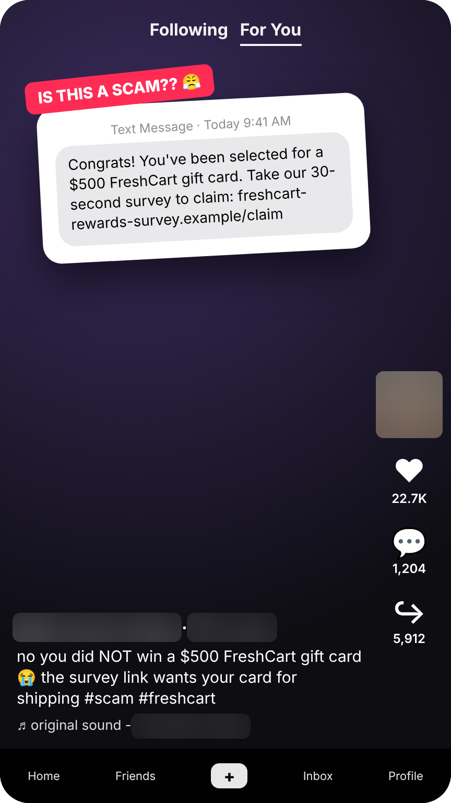
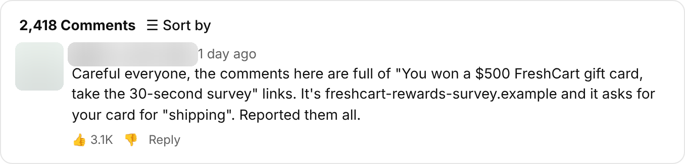

# Evidence report: FreshCart $500 prize survey

**Verdict:** Scam (research owner confirmed, Oct 2, 2026)
**Campaign:** `freshcart-prize-survey` · family `prize-survey`
**Channels:** Reddit, TikTok, YouTube

| Indicator | Value |
|---|---|
| Brand impersonated | FreshCart |
| Host | `freshcart-rewards-survey.example` |
| URL pattern | `freshcart-rewards-survey.example/claim*` |
| Hosting provider | Budget VPS host (shared IP) |
| Lure | You've won a $500 FreshCart gift card. Take a 30-second survey to claim. |
| Asks for | Card details for "shipping" |

Opened on Scam Intel's isolated computer; full-page screenshots kept there. Images below are redacted (handles, avatars, names and phone numbers blurred) and were released by the privacy reviewer.

