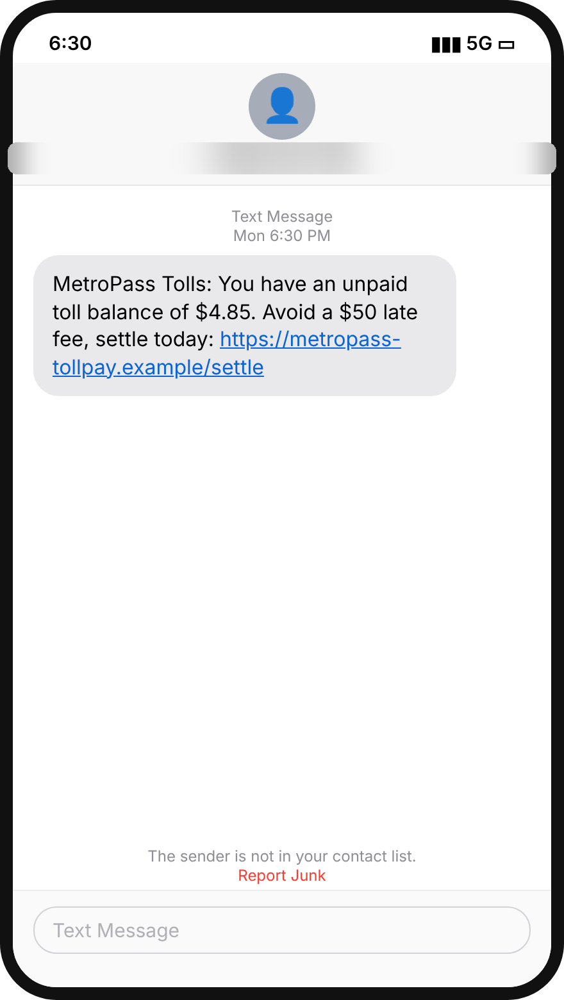
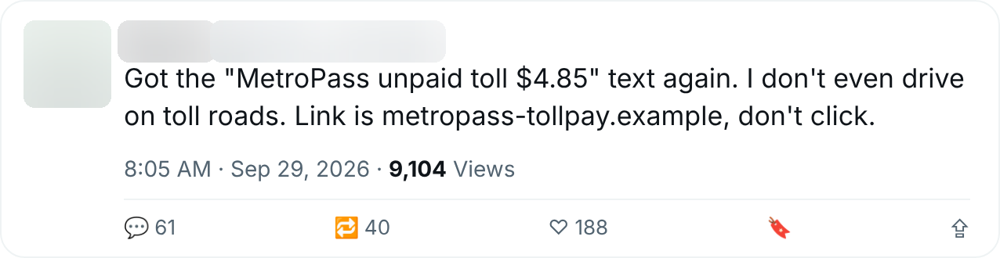

# Evidence report: MetroPass unpaid toll fee

**Verdict:** Scam (research owner confirmed, Sep 22, 2026)
**Campaign:** `metropass-unpaid-toll` · family `toll-fee-smishing`
**Channels:** SMS, X

| Indicator | Value |
|---|---|
| Brand impersonated | MetroPass Tolls |
| Host | `metropass-tollpay.example` |
| URL pattern | `metropass-tollpay.example/settle*` |
| Hosting provider | Budget VPS host (shared IP) |
| Lure | You have an unpaid toll balance of $4.85. Avoid a $50 late fee, settle today. |
| Asks for | Card details |

Opened on Scam Intel's isolated computer; full-page screenshots kept there. Images below are redacted (handles, avatars, names and phone numbers blurred) and were released by the privacy reviewer.

