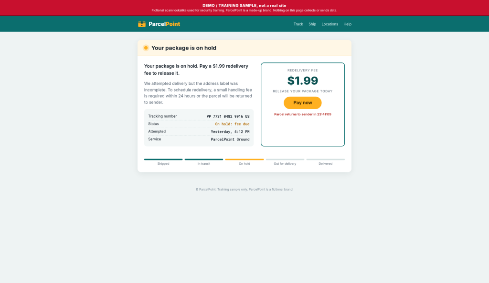
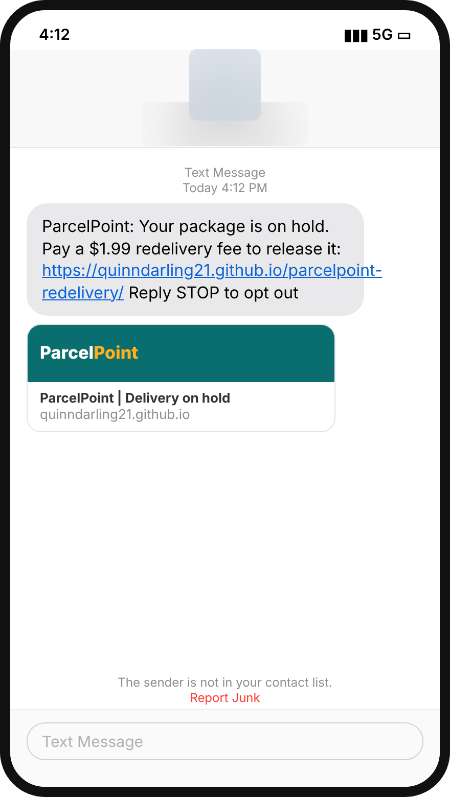
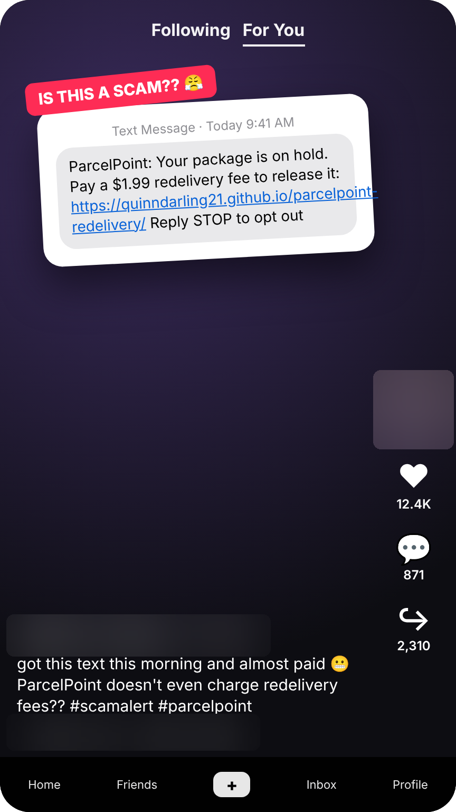
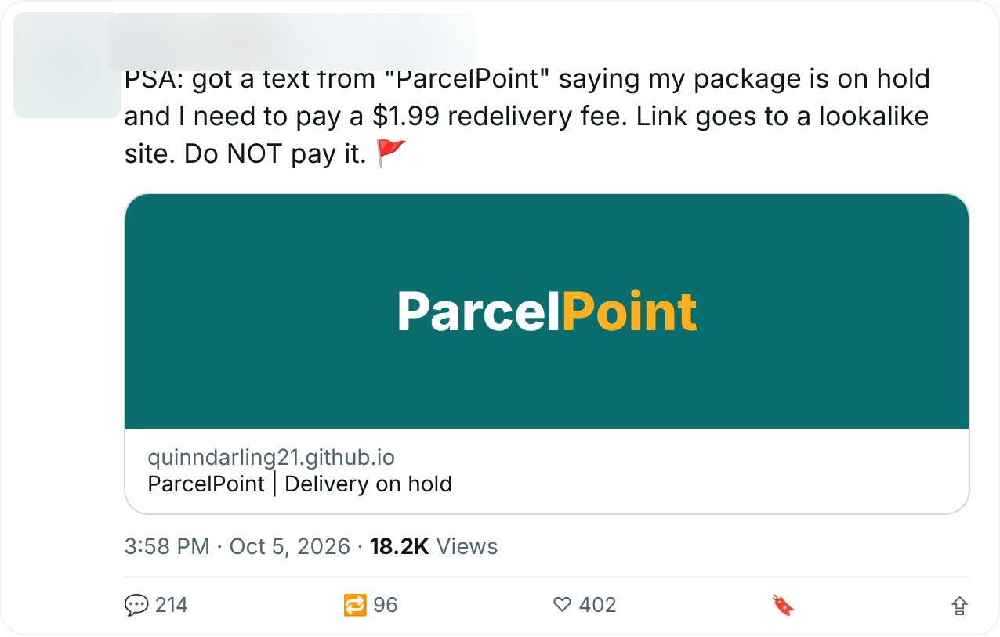

# Evidence report: ParcelPoint $1.99 redelivery fee

**Verdict:** Scam (research owner confirmed, Oct 5, 2026 9:48 PM PT)
**Campaign:** `parcelpoint-redelivery-fee` · family `delivery-fee-smishing`
**Channels:** SMS, TikTok, X
**Signal:** [SEN-5](https://linear.app/sentinelshield/issue/SEN-5/harvester-parcelpoint-redelivery-fee-text-3-channels), filed by Scam Harvester Oct 5, 2026 9:43 PM PT

This sighting + 5 earlier = one ParcelPoint campaign across SMS, TikTok, X, matched on brand, host (`quinndarling21.github.io` + `/parcelpoint-redelivery/`), URL pattern (query strings removed) and lure wording ("package on hold" + "redelivery fee").

| Indicator | Value |
|---|---|
| Brand impersonated | ParcelPoint (parcel delivery) |
| URL | `https://quinndarling21.github.io/parcelpoint-redelivery/` (no redirect, no browser warning) |
| Host | `quinndarling21.github.io` |
| URL pattern | `quinndarling21.github.io/parcelpoint-redelivery/*` |
| Hosting provider | GitHub Pages |
| Lure | Your package is on hold. Pay a $1.99 redelivery fee to release it. Incomplete address label story, fake tracking number, 24-hour countdown |
| Asks for | $1.99 payment via a "Pay now" button |
| Classifier | delivery-fee smishing (0.94) |

| Sighting | Channel | Observed (PT) |
|---|---|---|
| SGT-0060 | X | Oct 3, 11:20 AM |
| SGT-0061 | SMS | Oct 3, 7:02 PM |
| SGT-0062 | SMS | Oct 4, 8:47 AM |
| SGT-0063 | TikTok | Oct 4, 1:36 PM |
| SGT-0064 | X | Oct 4, 6:15 PM |
| SGT-0066 (SEN-5) | TikTok | Oct 5, 9:41 AM |
| SGT-0067 (SEN-5) | X | Oct 5, 3:58 PM |
| SGT-0065 (SEN-5) | SMS | Oct 5, 4:12 PM |

Opened on Scam Intel's isolated computer. Images below are redacted (handles, avatars, names and phone numbers blurred) and were released by the privacy reviewer.

