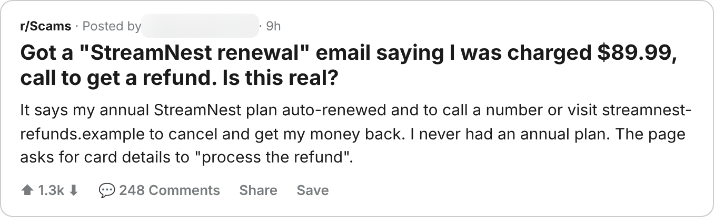
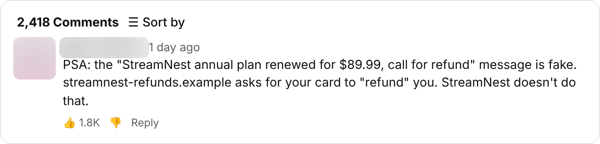

# Evidence report: StreamNest renewal refund

**Verdict:** Scam (research owner confirmed, Sep 29, 2026)
**Campaign:** `streamnest-renewal-refund` · family `refund-callback`
**Channels:** Reddit, X, YouTube

| Indicator | Value |
|---|---|
| Brand impersonated | StreamNest |
| Host | `streamnest-refunds.example` |
| URL pattern | `streamnest-refunds.example/*` |
| Hosting provider | Offshore bulletproof host |
| Lure | Your annual StreamNest plan renewed for $89.99. Call or visit to cancel and get a refund. |
| Asks for | Card details and remote access |

Opened on Scam Intel's isolated computer; full-page screenshots kept there. Images below are redacted (handles, avatars, names and phone numbers blurred) and were released by the privacy reviewer.

